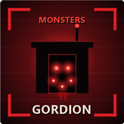

# MONSTERS GORDION

**Language / Язык:** [English](#english) · [Русский](#russian)

## MONSTERS GORDION

**Author:** Solo00n

The Company building on 71-Gordion is no longer safe — vanilla monsters now spawn and hunt inside it, on timers, weights and caps you control.

### WHAT IT DOES

- <strong style="color: #cc0000;">Monsters on the Company moon</strong> — enemies spawn inside the building on the interior navmesh, the one place the game never threatens you.
- <strong style="color: #cc0000;">Timed weighted spawning</strong> — a random interval between a min and max, then a weighted-random pick from every enemy you enabled.
- <strong style="color: #cc0000;">Reachability-checked points</strong> — connected-region analysis plus a path check, so nothing spawns on roofs, shelves or in pits it cannot leave.
- <strong style="color: #cc0000;">Floor balance</strong> — a configurable split between the ship-landing level and the basement, instead of everything piling into the larger lower floor.
- <strong style="color: #cc0000;">Indoor / outdoor pools</strong> — each spawn rolls which pool to draw from, so dogs, giants and Old Birds actually appear alongside interior enemies.
- <strong style="color: #cc0000;">Per-enemy control</strong> — every spawnable type gets <code>Enabled</code>, <code>SpawnWeight</code>, <code>MinSpawnCount</code> and <code>MaxSpawnCount</code>.
- <strong style="color: #cc0000;">Blacklist or whitelist</strong> — restrict the whole moon to a chosen set, optionally stripping enemies other mods spawn as well.
- <strong style="color: #cc0000;">Self-healing</strong> — stranded enemies are teleported back, idle ones are nudged, and any type that keeps dying instantly is auto-disabled instead of spammed.

### MONSTERS

Enabled by default: every interior enemy — Bracken, Thumper, Hoarding Bug, Snare Flea, Bunker Spider, Coil-Head, Ghost Girl, Spore Lizard, Nutcracker, Jester, Masked, Hygrodere, Butler, Barber, Maneater — plus <strong style="color: #cc0000;">Stingray</strong>, <strong style="color: #cc0000;">Tulip Snake</strong>, the bee swarms, and the outdoor threats that path correctly indoors: <strong style="color: #cc0000;">Baboon Hawk, Eyeless Dog, Forest Keeper, Old Bird and Giant Kiwi</strong>. Nest-requiring enemies get their nest placed automatically.

Monsters that need extra work to function on this moon, made to work here and toggleable in the config:

- <strong style="color: #cc0000;">Feiopar</strong> — the mod grows dead trees on the interior navmesh so it can climb, perch and pounce as it does outdoors.
- <strong style="color: #cc0000;">Earth Leviathan</strong> — the Company floor is registered as a surface it may breach, so it erupts indoors instead of circling below forever.
- <strong style="color: #cc0000;">Cadaver Bloom</strong> — planted as standalone corpse traps that burst and give chase, with no dungeon required.
- <strong style="color: #cc0000;">Kidnapper Fox</strong> — vain shrouds are grown on the moon so it has cover and survives.

<blockquote style="border-left: 4px solid #cc0000; padding-left: 15px;">
<strong style="color: #cc0000;">Cadaver Growths</strong> is intentionally left disabled: it hard-requires a generated dungeon, which the Company building is not. Use the Cadaver Bloom traps instead.
</blockquote>

### HOW IT WORKS

- Landing is detected by polling <code>StartOfRound.shipHasLanded</code> rather than hooking the doors sequence, so other mods cannot starve the trigger.
- The interior navmesh is triangulated, welded into connected regions and anchored, then every spawn point and patrol node must have a complete path to that anchor.
- The Company building has no vanilla interior AI nodes, so the mod generates its own patrol nodes tagged for both indoor and outdoor lookups.
- Spawned enemies are flagged as outdoor enemies: the game gates targeting behind <code>player.isInsideFactory != enemy.isOutside</code>, and players in the Company building are not flagged as being in a factory, so without this no enemy could ever chase or kill you.
- Enemies are created through <code>RoundManager.SpawnEnemyGameObject</code> — the game's own spawn path, no custom network objects.

### MULTIPLAYER (HOST-AUTHORITATIVE)

<blockquote style="border-left: 4px solid #cc0000; padding-left: 15px;">
Only the <strong style="color: #cc0000;">host needs this mod.</strong> Clients receive the enemies through the game's own netcode.
  
<strong style="color: #cc0000;">Spawning:</strong> the host alone runs the spawner and owns enemy AI; every spawn goes through the vanilla server spawn call and replicates to all clients. 
<strong style="color: #cc0000;">Clients:</strong> need <strong style="color: #cc0000;">NavMeshInCompanyRedux</strong> so the interior navmesh matches, but not this mod. 
<strong style="color: #cc0000;">Cleanup:</strong> when the ship leaves, the host despawns what it created, so nothing leaks between landings.
</blockquote>

### REQUIREMENTS

- <strong style="color: #cc0000;">BepInEx</strong> 5.4.21+ (<code>BepInEx-BepInExPack-5.4.2305</code>)
- <strong style="color: #cc0000;">NavMeshInCompanyRedux</strong> (<code>TRizzle-NavMeshInCompanyRedux</code>) — provides the interior navmesh everything spawns on
- Lethal Company <strong style="color: #cc0000;">V81</strong>

### INSTALLATION

- <strong style="color: #cc0000;">Mod manager</strong> (r2modman / Thunderstore Mod Manager): search for the mod and click Install; dependencies are pulled in automatically.
- <strong style="color: #cc0000;">Manual:</strong> install the BepInEx pack and NavMeshInCompanyRedux, then drop <code>MonstersGordion.dll</code> into <code>BepInEx/plugins/</code>.

### CONFIGURATION

File: <code>BepInEx/config/Timofey.MonstersGordion.cfg</code> (created on first launch, applied on game restart).

<table border="1" style="border-collapse: collapse; border: 1px solid #cc0000;">
<tr style="background: #1a1a1a;">
<th style="color: #cc0000;">Key</th><th style="color: #cc0000;">Default</th><th style="color: #cc0000;">Description</th>
</tr>
<tr><td><code>GlobalCap</code></td><td><code>5</code></td><td>Maximum enemies alive at once on the moon.</td></tr>
<tr><td><code>MinSpawnInterval</code></td><td><code>15</code></td><td>Minimum delay between spawn attempts, in seconds.</td></tr>
<tr><td><code>MaxSpawnInterval</code></td><td><code>45</code></td><td>Maximum delay between spawn attempts, in seconds.</td></tr>
<tr><td><code>RespawnOnLoad</code></td><td><code>true</code></td><td>Wipe existing enemies and repopulate on every landing.</td></tr>
<tr><td><code>DebugMode</code></td><td><code>false</code></td><td>Verbose logging of every spawn decision.</td></tr>
<tr><td><code>UpperFloorSpawnShare</code></td><td><code>70</code></td><td>Percent of spawns placed at the ship-landing level.</td></tr>
<tr><td><code>OutsideEnemyShare</code></td><td><code>50</code></td><td>Percent chance to draw from the outdoor enemy pool.</td></tr>
<tr><td><code>OldBirdUpperFloorOnly</code></td><td><code>true</code></td><td>Keep the Old Bird on the upper floor, where it has room.</td></tr>
<tr><td><code>AllowHarmlessCreatures</code></td><td><code>true</code></td><td>Master switch for the Manticoil and the Roaming Locust swarm.</td></tr>
<tr><td><code>EarthLeviathanFloorEmerge</code></td><td><code>true</code></td><td>Let the worm breach up through the building floor.</td></tr>
<tr><td><code>CoilHeadTurretChance</code></td><td><code>25</code></td><td>Percent chance a Coil-Head spawns with a ToilHead turret.</td></tr>
<tr><td><code>ManticoilTurretChance</code></td><td><code>25</code></td><td>Same, for the Manticoil.</td></tr>
<tr><td><code>MaskedTurretChance</code></td><td><code>0</code></td><td>Same, for the Masked.</td></tr>
<tr><td><code>FeioparDeadTrees</code></td><td><code>true</code></td><td>Grow dead trees so Feiopar can stalk and pounce.</td></tr>
<tr><td><code>CadaverBloomTraps</code></td><td><code>true</code></td><td>Plant standalone Cadaver Bloom traps, no dungeon needed.</td></tr>
<tr><td><code>VainShroudIterations</code></td><td><code>0</code></td><td>Vain shroud density for the Kidnapper Fox; 0 is automatic.</td></tr>
<tr><td><code>ExcludedEnemies</code></td><td><code></code></td><td>Comma-separated list of enemy names to exclude.</td></tr>
<tr><td><code>ExcludedEnemiesIsWhitelist</code></td><td><code>false</code></td><td>Flip that list into an allow-list instead.</td></tr>
<tr><td><code>ForeignEnemies</code></td><td><code>RemoveExcluded</code></td><td>Apply the list to enemies other mods spawn as well.</td></tr>
<tr><td><code>CountForeignEnemies</code></td><td><code>true</code></td><td>Other mods' enemies count toward the caps.</td></tr>
<tr><td><code>TreatEnemiesAsOutside</code></td><td><code>true</code></td><td>Required for enemies to be able to target players.</td></tr>
<tr><td><code>EnableStockEvents</code></td><td><code>false</code></td><td>Let curated stock BrutalCompanyMinus events run on Gordion.</td></tr>
<tr><td><code>StockEventWhitelist</code></td><td><code>Nothing, Gloomy, ...</code></td><td>Which stock events are allowed here; empty means the built-in list.</td></tr>
<tr><td><code>HazardDensityMultiplier</code></td><td><code>1</code></td><td>Scales how many turrets, landmines or trees an event places here.</td></tr>
<tr><td><code>HazardMaxPerEvent</code></td><td><code>40</code></td><td>Hard ceiling on objects placed by one event.</td></tr>
<tr><td><code>Horde.Enabled</code></td><td><code>true</code></td><td>A horde closes in from both far edges of the map on every landing.</td></tr>
<tr><td><code>Horde.Enemy</code></td><td><code>Masked</code></td><td>Which enemy arrives, by its in-game name.</td></tr>
<tr><td><code>Horde.CountPerSide</code></td><td><code>5</code></td><td>How many arrive at each of the two edges.</td></tr>
<tr><td><code>Horde.DelaySeconds</code></td><td><code>240</code></td><td>Seconds after landing before they arrive.</td></tr>
<tr><td><code>Horde.RepeatSeconds</code></td><td><code>0</code></td><td>0 is one wave per landing; otherwise the gap between waves.</td></tr>
<tr><td><code>Horde.Announce</code></td><td><code>true</code></td><td>Announce each wave in chat as it arrives.</td></tr>
</table>

<blockquote style="border-left: 4px solid #cc0000; padding-left: 15px;">
Every spawnable enemy also gets its own section — <code>[Enemy.Flowerman]</code>, <code>[Enemy.Bunker Spider]</code> and so on — with <code>Enabled</code>, <code>SpawnWeight</code>, <code>MinSpawnCount</code> and <code>MaxSpawnCount</code>. <code>MaxSpawnCount</code> defaults high, so <code>GlobalCap</code> is the only limit until you cap a type yourself. Further tuning (<code>MinDistanceFromPlayers</code>, <code>AINodeCount</code>, <code>RequireIndoorPoints</code>, <code>MaintenanceInterval</code>) lives in the <code>Advanced</code> section.
</blockquote>

### INTEGRATIONS AND COMPATIBILITY

- <strong style="color: #cc0000;">ToilHead</strong> — per-enemy turret chances for Coil-Head, Manticoil and Masked, including the Slayer variants.
- <strong style="color: #cc0000;">StarlancerAIFix</strong> — detected automatically; its AI fix applies to spawned enemies, and this mod's interior node assignment runs afterwards.
- <strong style="color: #cc0000;">BrutalCompanyMinus (ExtraReborn)</strong> — shares one enemy budget through <code>CountForeignEnemies</code>, so the two never stack past your cap. It also brings its events to Gordion, which BCMER itself never does: its level hook returns early on this moon, so no config key, no per-event moon whitelist and not even the <code>MEVENT</code> command can trigger one here. With <code>EnableStockEvents</code> the mod rolls one event per landing from a curated list of events that can actually work without a dungeon, and hands it back to BCMER to run — your BCMER config still decides everything, from the per-event enable flag to the event type weights. The list was picked by reading each event's own code rather than its description, because BCMER's eligibility checks are often unrelated to what the event does: <code>Warzone</code> and <code>Trees</code> both refuse to run unless the moon already has a turret in its hazard table, which Gordion never does.
- <strong style="color: #cc0000;">WeatherGordion</strong> — required for the <code>AllWeather</code> event. That event refuses to run unless the moon has at least three weathers in its pool, and Gordion's pool is empty in vanilla; WeatherGordion is what fills it. Without it the event declines itself and says so in the log.
- All integrations are resolved at runtime by reflection, so the mod runs with or without them and never hard-depends on their versions.
- Modded enemies appear in the config automatically but stay disabled until you enable them.

### BUILD

<pre style="border: 1px solid #cc0000; padding: 10px;">dotnet build MonstersGordion.csproj -c Release</pre>

Output: <code>bin/Release/netstandard2.1/MonstersGordion.dll</code>. Game assemblies are referenced through the <code>LethalCompany.GameLibs.Steam</code> NuGet package as compile-only (<code>PrivateAssets="all"</code>) — no game files are distributed.

### CREDITS

- <strong style="color: #cc0000;">Solo00n</strong> — author.
- Built on <strong style="color: #cc0000;">BepInEx</strong> and <strong style="color: #cc0000;">HarmonyX</strong>.
- Requires <strong style="color: #cc0000;">NavMeshInCompanyRedux</strong> by T-Rizzle for the interior navmesh.
- Vain shroud technique inspired by <em>FoxLover</em> by ButteryStancakes.
- Licensed under <strong style="color: #cc0000;">MIT</strong>.

## MONSTERS GORDION

**Автор:** Solo00n

Здание Компании на 71-Гордион больше не безопасно — внутри него теперь появляются и охотятся ванильные монстры, а таймеры, веса и лимиты полностью в ваших руках.

### ЧТО ДЕЛАЕТ МОД

- <strong style="color: #cc0000;">Монстры на луне Компании</strong> — враги появляются внутри здания на интерьерном навмеше, в единственном месте, где игра никогда не угрожает.
- <strong style="color: #cc0000;">Спавн по таймеру с весами</strong> — случайный интервал между минимумом и максимумом, затем взвешенный выбор из всех включённых врагов.
- <strong style="color: #cc0000;">Проверка достижимости точек</strong> — анализ связных областей и проверка пути, поэтому никто не появится на крыше, полке или в яме, откуда не выбраться.
- <strong style="color: #cc0000;">Баланс по этажам</strong> — настраиваемое распределение между уровнем посадки корабля и подвалом, вместо скатывания всех спавнов на просторный нижний этаж.
- <strong style="color: #cc0000;">Пулы улицы и помещения</strong> — каждый спавн решает, из какого пула брать врага, поэтому собаки, гиганты и Old Bird появляются наравне с интерьерными.
- <strong style="color: #cc0000;">Настройка каждого монстра</strong> — у любого типа есть <code>Enabled</code>, <code>SpawnWeight</code>, <code>MinSpawnCount</code> и <code>MaxSpawnCount</code>.
- <strong style="color: #cc0000;">Чёрный или белый список</strong> — можно ограничить всю луну выбранным набором, при желании удаляя и тех, кого спавнят другие моды.
- <strong style="color: #cc0000;">Самовосстановление</strong> — застрявшие враги телепортируются обратно, замершие получают новую цель, а тип, который постоянно умирает мгновенно, отключается вместо бесконечного спама.

### МОНСТРЫ

Включены по умолчанию: все интерьерные враги — Bracken, Thumper, Hoarding Bug, Snare Flea, Bunker Spider, Coil-Head, Ghost Girl, Spore Lizard, Nutcracker, Jester, Masked, Hygrodere, Butler, Barber, Maneater — плюс <strong style="color: #cc0000;">Stingray</strong>, <strong style="color: #cc0000;">Tulip Snake</strong>, рои пчёл и уличные угрозы, которые корректно ходят внутри: <strong style="color: #cc0000;">Baboon Hawk, Eyeless Dog, Forest Keeper, Old Bird и Giant Kiwi</strong>. Тем, кому нужно гнездо, мод ставит его автоматически.

Монстры, которым для работы на этой луне нужна дополнительная механика, реализованная модом и настраиваемая в конфиге:

- <strong style="color: #cc0000;">Feiopar</strong> — мод выращивает мёртвые деревья на интерьерном навмеше, чтобы он забирался, сидел в засаде и прыгал, как на улице.
- <strong style="color: #cc0000;">Earth Leviathan</strong> — пол здания регистрируется как поверхность, сквозь которую можно вынырнуть, поэтому червь атакует внутри, а не кружит под полом.
- <strong style="color: #cc0000;">Cadaver Bloom</strong> — высаживается как самостоятельная ловушка-труп, которая раскрывается и бросается в погоню, без всякого данжена.
- <strong style="color: #cc0000;">Kidnapper Fox</strong> — на луне выращиваются вайншрауды, чтобы лисе было где прятаться и она выживала.

<blockquote style="border-left: 4px solid #cc0000; padding-left: 15px;">
<strong style="color: #cc0000;">Cadaver Growths</strong> намеренно оставлен выключенным: ему жёстко нужен сгенерированный данжен, которым здание Компании не является. Используйте ловушки Cadaver Bloom.
</blockquote>

### КАК ЭТО РАБОТАЕТ

- Посадка определяется опросом <code>StartOfRound.shipHasLanded</code>, а не хуком на последовательность дверей, поэтому другие моды не могут перехватить триггер.
- Интерьерный навмеш триангулируется, сшивается в связные области и получает якорь, после чего каждая точка спавна и каждая нода патруля обязаны иметь полный путь до этого якоря.
- В здании Компании нет ванильных интерьерных AI-нод, поэтому мод создаёт свои, помеченные тегами и для внутреннего, и для внешнего поиска.
- Заспавненные враги помечаются как уличные: игра разрешает выбор цели по условию <code>player.isInsideFactory != enemy.isOutside</code>, а игрок в здании Компании не считается находящимся на фабрике, поэтому без этого ни один враг не смог бы преследовать и убивать.
- Враги создаются через <code>RoundManager.SpawnEnemyGameObject</code> — штатный путь спавна самой игры, без собственных сетевых объектов.

### МУЛЬТИПЛЕЕР (HOST-AUTHORITATIVE)

<blockquote style="border-left: 4px solid #cc0000; padding-left: 15px;">
Мод нужен <strong style="color: #cc0000;">только хосту.</strong> Клиенты получают врагов через штатный неткод игры.
  
<strong style="color: #cc0000;">Спавн:</strong> спавнер работает только у хоста, он же владеет ИИ врагов; каждый спавн идёт через ванильный серверный вызов и реплицируется всем клиентам. 
<strong style="color: #cc0000;">Клиенты:</strong> им нужен <strong style="color: #cc0000;">NavMeshInCompanyRedux</strong>, чтобы навмеш совпадал, но сам этот мод не нужен. 
<strong style="color: #cc0000;">Очистка:</strong> при отлёте корабля хост удаляет созданных им врагов, поэтому между вылетами ничего не накапливается.
</blockquote>

### ЗАВИСИМОСТИ

- <strong style="color: #cc0000;">BepInEx</strong> 5.4.21+ (<code>BepInEx-BepInExPack-5.4.2305</code>)
- <strong style="color: #cc0000;">NavMeshInCompanyRedux</strong> (<code>TRizzle-NavMeshInCompanyRedux</code>) — даёт интерьерный навмеш, на котором всё спавнится
- Lethal Company <strong style="color: #cc0000;">V81</strong>

### УСТАНОВКА

- <strong style="color: #cc0000;">Через менеджер</strong> (r2modman / Thunderstore Mod Manager): найти мод и нажать Install, зависимости подтянутся сами.
- <strong style="color: #cc0000;">Вручную:</strong> установить BepInEx-пак и NavMeshInCompanyRedux, затем положить <code>MonstersGordion.dll</code> в <code>BepInEx/plugins/</code>.

### НАСТРОЙКА

Файл: <code>BepInEx/config/Timofey.MonstersGordion.cfg</code> (создаётся при первом запуске, применяется после перезапуска игры).

<table border="1" style="border-collapse: collapse; border: 1px solid #cc0000;">
<tr style="background: #1a1a1a;">
<th style="color: #cc0000;">Ключ</th><th style="color: #cc0000;">По умолчанию</th><th style="color: #cc0000;">Описание</th>
</tr>
<tr><td><code>GlobalCap</code></td><td><code>5</code></td><td>Максимум одновременно живых врагов на луне.</td></tr>
<tr><td><code>MinSpawnInterval</code></td><td><code>15</code></td><td>Минимальная задержка между попытками спавна, в секундах.</td></tr>
<tr><td><code>MaxSpawnInterval</code></td><td><code>45</code></td><td>Максимальная задержка между попытками спавна, в секундах.</td></tr>
<tr><td><code>RespawnOnLoad</code></td><td><code>true</code></td><td>Очищать врагов и заселять луну заново при каждой посадке.</td></tr>
<tr><td><code>DebugMode</code></td><td><code>false</code></td><td>Подробный лог каждого решения спавнера.</td></tr>
<tr><td><code>UpperFloorSpawnShare</code></td><td><code>70</code></td><td>Процент спавнов на уровне посадки корабля.</td></tr>
<tr><td><code>OutsideEnemyShare</code></td><td><code>50</code></td><td>Процент шанса взять врага из уличного пула.</td></tr>
<tr><td><code>OldBirdUpperFloorOnly</code></td><td><code>true</code></td><td>Держать Old Bird на верхнем этаже, где ему есть где развернуться.</td></tr>
<tr><td><code>AllowHarmlessCreatures</code></td><td><code>true</code></td><td>Общий выключатель для Manticoil и роя саранчи.</td></tr>
<tr><td><code>EarthLeviathanFloorEmerge</code></td><td><code>true</code></td><td>Разрешить червю выныривать сквозь пол здания.</td></tr>
<tr><td><code>CoilHeadTurretChance</code></td><td><code>25</code></td><td>Процент шанса, что у Coil-Head будет турель от ToilHead.</td></tr>
<tr><td><code>ManticoilTurretChance</code></td><td><code>25</code></td><td>То же самое для Manticoil.</td></tr>
<tr><td><code>MaskedTurretChance</code></td><td><code>0</code></td><td>То же самое для Masked.</td></tr>
<tr><td><code>FeioparDeadTrees</code></td><td><code>true</code></td><td>Выращивать мёртвые деревья, чтобы Feiopar охотился из засады.</td></tr>
<tr><td><code>CadaverBloomTraps</code></td><td><code>true</code></td><td>Высаживать самостоятельные ловушки Cadaver Bloom без данжена.</td></tr>
<tr><td><code>VainShroudIterations</code></td><td><code>0</code></td><td>Густота вайншраудов для лисы; 0 означает автоматический режим.</td></tr>
<tr><td><code>ExcludedEnemies</code></td><td><code></code></td><td>Список имён врагов через запятую для исключения.</td></tr>
<tr><td><code>ExcludedEnemiesIsWhitelist</code></td><td><code>false</code></td><td>Превратить этот список в белый список.</td></tr>
<tr><td><code>ForeignEnemies</code></td><td><code>RemoveExcluded</code></td><td>Применять список и к врагам, которых спавнят другие моды.</td></tr>
<tr><td><code>CountForeignEnemies</code></td><td><code>true</code></td><td>Враги других модов учитываются в лимитах.</td></tr>
<tr><td><code>TreatEnemiesAsOutside</code></td><td><code>true</code></td><td>Обязательно, чтобы враги могли выбирать игроков целью.</td></tr>
<tr><td><code>EnableStockEvents</code></td><td><code>false</code></td><td>Разрешить отобранным штатным ивентам BrutalCompanyMinus идти на Гордионе.</td></tr>
<tr><td><code>StockEventWhitelist</code></td><td><code>Nothing, Gloomy, ...</code></td><td>Какие штатные ивенты здесь допущены; пусто — встроенный список.</td></tr>
<tr><td><code>HazardDensityMultiplier</code></td><td><code>1</code></td><td>Множитель числа турелей, мин и деревьев, которые ставит ивент.</td></tr>
<tr><td><code>HazardMaxPerEvent</code></td><td><code>40</code></td><td>Жёсткий потолок на количество объектов от одного ивента.</td></tr>
<tr><td><code>Horde.Enabled</code></td><td><code>true</code></td><td>Орда заходит с двух дальних краёв карты на каждой высадке.</td></tr>
<tr><td><code>Horde.Enemy</code></td><td><code>Masked</code></td><td>Кто именно приходит — внутриигровое имя врага.</td></tr>
<tr><td><code>Horde.CountPerSide</code></td><td><code>5</code></td><td>Сколько появится у каждого из двух краёв.</td></tr>
<tr><td><code>Horde.DelaySeconds</code></td><td><code>240</code></td><td>Через сколько секунд после посадки они приходят.</td></tr>
<tr><td><code>Horde.RepeatSeconds</code></td><td><code>0</code></td><td>0 — одна волна за высадку, иначе промежуток между волнами.</td></tr>
<tr><td><code>Horde.Announce</code></td><td><code>true</code></td><td>Объявлять каждую волну в чате.</td></tr>
</table>

<blockquote style="border-left: 4px solid #cc0000; padding-left: 15px;">
У каждого спавнящегося врага есть своя секция — <code>[Enemy.Flowerman]</code>, <code>[Enemy.Bunker Spider]</code> и так далее — с параметрами <code>Enabled</code>, <code>SpawnWeight</code>, <code>MinSpawnCount</code> и <code>MaxSpawnCount</code>. Значение <code>MaxSpawnCount</code> по умолчанию высокое, поэтому единственным ограничением остаётся <code>GlobalCap</code>, пока вы сами не ограничите конкретный тип. Тонкая настройка (<code>MinDistanceFromPlayers</code>, <code>AINodeCount</code>, <code>RequireIndoorPoints</code>, <code>MaintenanceInterval</code>) находится в разделе <code>Advanced</code>.
</blockquote>

### ИНТЕГРАЦИИ И СОВМЕСТИМОСТЬ

- <strong style="color: #cc0000;">ToilHead</strong> — отдельные шансы турели для Coil-Head, Manticoil и Masked, включая варианты Slayer.
- <strong style="color: #cc0000;">StarlancerAIFix</strong> — определяется автоматически; его фикс применяется к заспавненным врагам, а назначение интерьерных нод этим модом выполняется после него.
- <strong style="color: #cc0000;">BrutalCompanyMinus (ExtraReborn)</strong> — делит общий лимит врагов через <code>CountForeignEnemies</code>, поэтому суммарная популяция не превысит ваш кап. А ещё приводит на Гордион свои ивенты, чего сам BCMER не делает никогда: его хук уровня выходит на этой луне досрочно, поэтому здесь бессильны и настройки, и белые списки лун у ивентов, и даже команда <code>MEVENT</code>. При <code>EnableStockEvents</code> мод раз за высадку разыгрывает один ивент из отобранного списка тех, что работают без подземелья, и передаёт его обратно BCMER на исполнение — все решения по-прежнему за вашим конфигом BCMER, от галочки у ивента до весов типов. Список собран чтением кода каждого ивента, а не описаний: проверки пригодности в BCMER часто не связаны с самим ивентом — <code>Warzone</code> и <code>Trees</code> оба отказываются работать, если у луны нет турели в таблице опасностей, а у Гордиона её нет никогда.
- <strong style="color: #cc0000;">WeatherGordion</strong> — нужен для ивента <code>AllWeather</code>. Тот отказывается работать, если в пуле луны меньше трёх погод, а у Гордиона он в ванили пуст; наполняет его именно WeatherGordion. Без него ивент отклоняет сам себя и пишет об этом в лог.
- Все интеграции определяются в рантайме через рефлексию, поэтому мод работает и с ними, и без них, и не привязан жёстко к их версиям.
- Модовые враги появляются в конфиге автоматически, но остаются выключенными, пока вы сами их не включите.

### СБОРКА

<pre style="border: 1px solid #cc0000; padding: 10px;">dotnet build MonstersGordion.csproj -c Release</pre>

Результат: <code>bin/Release/netstandard2.1/MonstersGordion.dll</code>. Сборки игры подключены через NuGet-пакет <code>LethalCompany.GameLibs.Steam</code> только для компиляции (<code>PrivateAssets="all"</code>) — файлы игры не распространяются.

### БЛАГОДАРНОСТИ

- <strong style="color: #cc0000;">Solo00n</strong> — автор.
- Построено на <strong style="color: #cc0000;">BepInEx</strong> и <strong style="color: #cc0000;">HarmonyX</strong>.
- Требуется <strong style="color: #cc0000;">NavMeshInCompanyRedux</strong> от T-Rizzle для интерьерного навмеша.
- Идея выращивания вайншраудов вдохновлена модом <em>FoxLover</em> от ButteryStancakes.
- Лицензия <strong style="color: #cc0000;">MIT</strong>.
